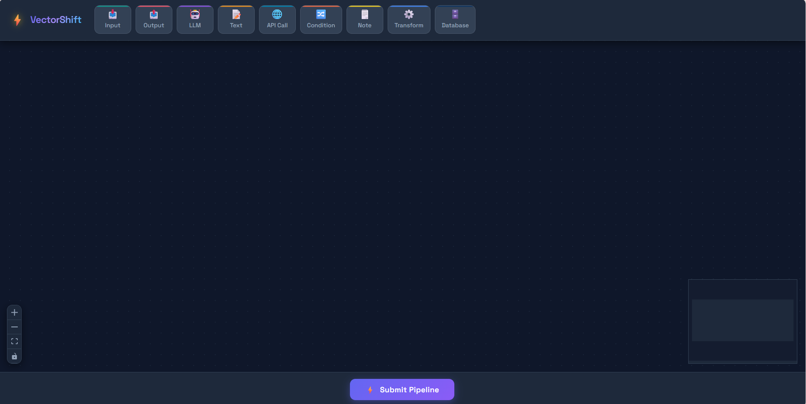
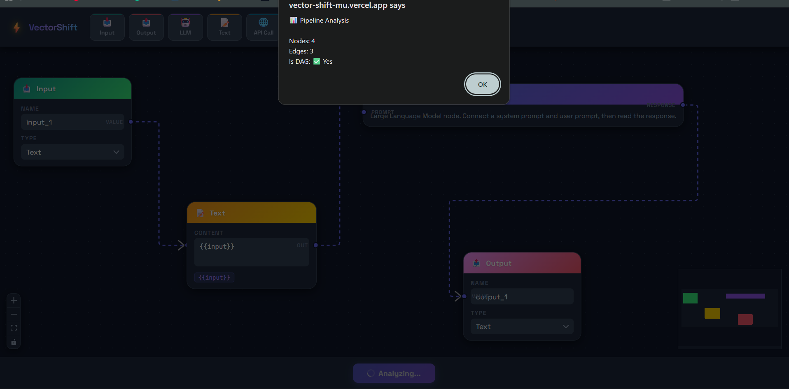

# VectorShift – Visual Pipeline Builder

A modern drag-and-drop visual pipeline builder built with **React**, **React Flow**, **Zustand**, and **FastAPI**. Users can create workflows by connecting different node types on an interactive canvas and analyze the resulting pipeline through a backend API that validates whether the graph forms a **Directed Acyclic Graph (DAG)**.

---

## Tech Stack

### Frontend
- React
- React Flow
- Zustand
- CSS

### Backend
- Python
- FastAPI
- Uvicorn

### Deployment
- Frontend: Vercel
- Backend: Render

---

## Live Demo

### Frontend
https://vector-shift-mu.vercel.app

### Backend API
https://vectorshift-backend-bay1.onrender.com

### API Documentation
https://vectorshift-backend-bay1.onrender.com/docs

---

## Project Structure

```text
VectorShift/
├── frontend/
│   ├── public/
│   └── src/
│       ├── nodes/
│       │   ├── BaseNode.js
│       │   ├── inputNode.js
│       │   ├── outputNode.js
│       │   ├── llmNode.js
│       │   ├── textNode.js
│       │   ├── apiNode.js
│       │   ├── conditionNode.js
│       │   ├── noteNode.js
│       │   ├── transformNode.js
│       │   └── databaseNode.js
│       ├── App.js
│       ├── ui.js
│       ├── toolbar.js
│       ├── submit.js
│       ├── store.js
│       └── index.css
│
├── backend/
│   ├── main.py
│   └── requirements.txt
│
├── SnapShots/
│   ├── Home.png
│   ├── Adding Tools.png
│   └── Result.png
│
└── README.md
```

---

# Screenshots

## Home



---

## Adding Nodes


---

## Pipeline Analysis Result



---

## Getting Started

### Prerequisites

- Node.js 16+
- Python 3.8+
- npm

---

## 1. Clone Repository

```bash
git clone <your-repository-url>

cd VectorShift
```

---

## 2. Backend Setup

```bash
cd backend

pip install -r requirements.txt

uvicorn main:app --reload
```

Backend runs at

```
http://127.0.0.1:8000
```

Swagger Documentation

```
http://127.0.0.1:8000/docs
```

---

## 3. Frontend Setup

Open another terminal

```bash
cd frontend

npm install

npm start
```

Frontend runs at

```
http://localhost:3000
```

> Ensure both frontend and backend are running before submitting a pipeline.

---

# Features

## 1. Reusable Node Architecture

Implemented a reusable **BaseNode** component that powers all node types.

Each node accepts configurable properties such as:

- title
- icon
- header color
- input handles
- output handles

Using this abstraction, the following custom nodes were created:

- Input
- Output
- LLM
- Text
- API Call
- Condition
- Note
- Transform
- Database

This significantly reduces duplicate code and makes adding new node types straightforward.

---

## 2. Interactive Pipeline Editor

Built using **React Flow**, allowing users to:

- Drag nodes onto the canvas
- Connect nodes visually
- Move nodes freely
- Delete nodes
- Zoom and pan
- View workflow using the MiniMap

---

## 3. Modern UI

Designed a responsive dark-themed interface featuring:

- Gradient node headers
- Color-coded node palette
- Animated edges
- Custom handles
- Floating toolbar
- Styled submit button
- Interactive minimap

---

## 4. Dynamic Text Node

The Text node supports advanced behavior.

### Auto Resize

The node automatically expands while typing.

### Dynamic Variables

Typing

```text
{{variableName}}
```

automatically creates new input handles for each unique variable detected.

---

## 5. Backend Integration

The frontend sends the complete pipeline to the FastAPI backend.

```http
POST /pipelines/parse
```

Payload

```json
{
  "nodes": [],
  "edges": []
}
```

The backend returns

```json
{
  "num_nodes": 4,
  "num_edges": 3,
  "is_dag": true
}
```

The response is displayed on the frontend after pipeline analysis.

---

## 6. DAG Detection

The backend validates whether the pipeline forms a **Directed Acyclic Graph (DAG)** using **Kahn's Algorithm**.

It computes:

- Total Nodes
- Total Edges
- DAG Validation

---

## Usage

1. Drag nodes from the toolbar.
2. Drop them onto the canvas.
3. Connect nodes using edges.
4. Use the Text node with:

```text
{{variable}}
```

to generate dynamic input handles.

5. Click **Submit Pipeline**.

6. View:

- Number of Nodes
- Number of Edges
- DAG Status

---

## Future Improvements

- Save and Load Pipelines
- Undo / Redo Support
- Pipeline Export & Import
- Node Search
- Real-time Collaboration
- Workflow Templates
- Pipeline Execution Engine

---

## Author

**Shashank Shekhar**

GitHub: https://github.com/ShashankShekhar31

LinkedIn: https://www.linkedin.com/in/shashank-shekhar-61633a273
